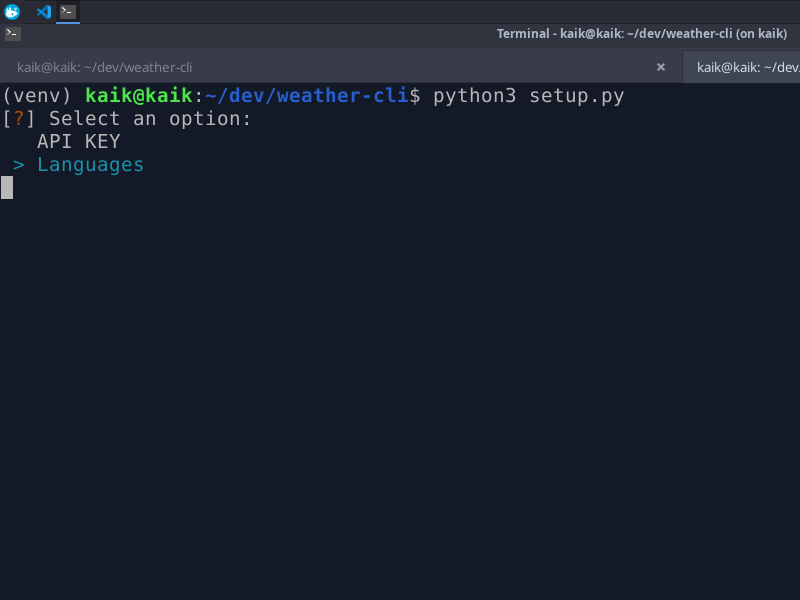

# 🌦️ Weather CLI

[📜 Inglês](README.md) | [📜 Português](README-PT.md)

Weather CLI é uma ferramenta de linha de comando simples para obter informações meteorológicas em tempo real usando a WeatherAPI. O projeto permite configurar uma API Key e selecionar um idioma para exibição dos dados.



## 📌 Recursos
- 🌎 Consulta informações meteorológicas de qualquer cidade
- 🌡️ Exibe temperatura, umidade, vento, pressão e mais
- 🌍 Suporte a múltiplos idiomas
- ⚙️ Configuração simples via `setup.py`

## 🚀 Instalação

### 1️⃣ Clone o repositório:
```sh
git clone https://github.com/k4ik/weather-cli.git
cd weather-cli
```

### 2️⃣ Crie um ambiente virtual (opcional, mas recomendado):
```sh
python3 -m venv venv
source venv/bin/activate  # Linux/Mac
venv\Scripts\activate  # Windows
```

### 3️⃣ Instale as dependências:
```sh
pip install -r requirements.txt
```

## ⚙️ Configuração
### 1️⃣ Configure a API Key e o idioma:
```sh
python setup.py
```
Siga as instruções na tela para inserir sua chave da WeatherAPI e escolher um idioma.

## 🌦️ Como Usar
### 1️⃣ Buscar previsão do tempo para uma cidade:
```sh
python weather.py [nome_da_cidade]
```
Exemplo:
```sh
python weather.py "São Paulo"
```
Saída esperada:
```
📍 Localização: São Paulo, São Paulo, Brasil (23.55, -46.63)
🕒 Horário local: 2025-02-08 19:19
🌡️ Temperatura: 25.3°C (Sensação térmica: 27.0°C)
⛅ Condição: Parcialmente nublado
💧 Umidade: 68%
⚖️ Pressão: 1013.0 mb
💨 Vento: 12.0 km/h NE
🌧️ Precipitação: 0.0 mm
🔆 Índice UV: 5.0
```

## 📜 Licença
Este projeto está sob a licença MIT.
